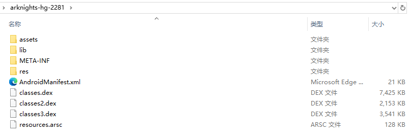
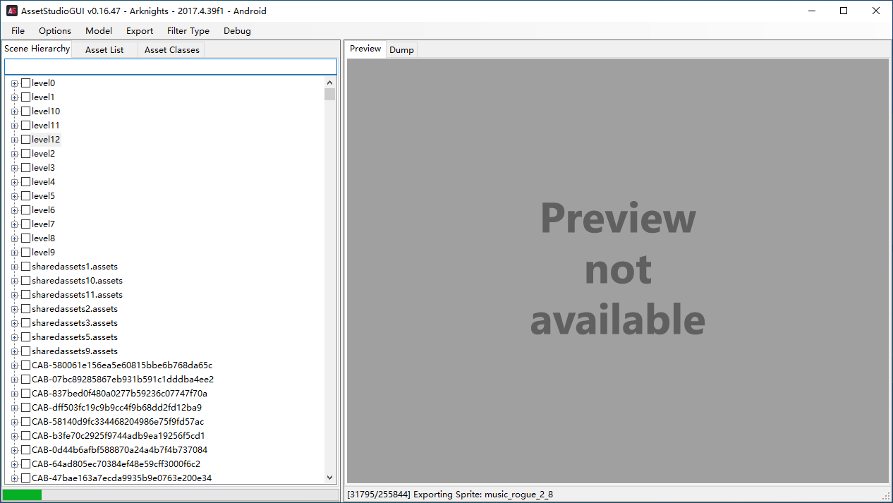
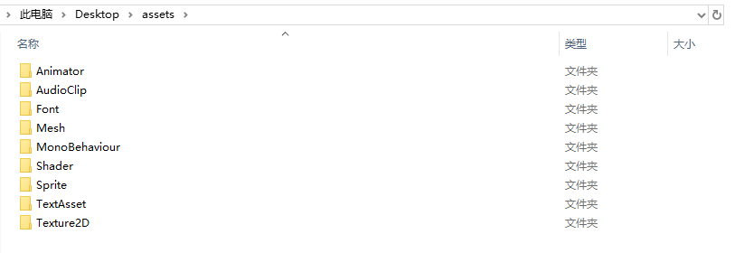
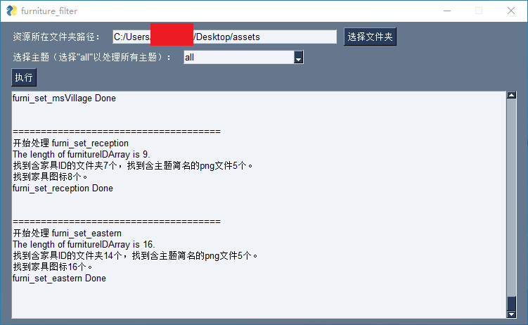
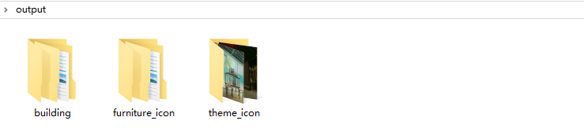
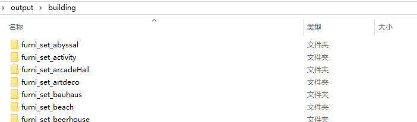
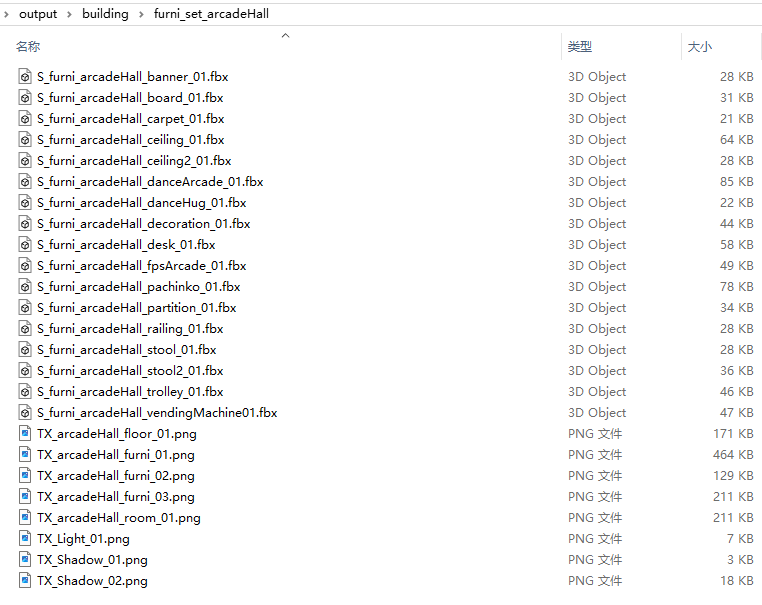

用于检索出明日方舟的资源文件中关于给定主题的家具的相关文件。

给定一个主题ID，将这个主题里的各个家具在资源文件夹内的相关资源文件（fbx、png）找出来，复制到output文件夹中，同时用md5去重。

`building_data.json`文件是从 [Kengxxiao/ArknightsGameData](https://github.com/Kengxxiao/ArknightsGameData) 拿的。

# 2024-06-08补充

## 常见问题

### `building_data.json` 文件是什么

它是游戏中家具的数据文件，记录着“目前都有哪些主题”、“每个主题有哪些家具”、“每个家具叫什么、描述文案是什么”等等信息。

在运行此项目之前，建议将 `building_data.json` 文件手动更新为 [Kengxxiao/ArknightsGameData](https://github.com/Kengxxiao/ArknightsGameData) 中最新的这个文件。注意保持文件名不变。

如果不更新，则拿不到最新的家具和主题的信息。例如，这个文件是 23 年的，明日方舟在 24 年新增了“家具主题A”，如果你使用这个 23 年的旧文件，那么将无法检索出“家具主题A”的家具文件。

### 如何获取游戏资源文件

具体可以参考 [这篇文章](https://www.bilibili.com/read/cv2777112/) 的第一部分。

其实就是两步。首先拿到很多以 `.ab` 为后缀的文件，可以从 apk 文件和安卓手机上相关文件夹中拿到。然后使用相关工具将 `.ab` 文件解包为原本的资源文件（png、fbx、wav 等等），推荐使用 [这个工具 Perfare/AssetStudio](https://github.com/Perfare/AssetStudio) 。

## 操作示例

#### 1. 解压 apk 文件

> 注意这里为了简单演示，只使用了 apk 文件，意味着资源并不是齐全的。

#### 2. 解包资源

> 这里会有一些技巧，比如只需解包某些文件夹的资源等。当然全部解包也行，只是会慢一些。

#### 3. 运行本项目的代码

> 这里也有一些技巧，比如 `MonoBehaviour` 文件夹有大量文件，并且我们不会用到，直接删除则可以大幅加快检索速度。`Shader`、`TextAsset`、`AudioClip`、`Font` 其实也都可以删掉。

#### 4. 输出文件夹

building 文件夹内的每个文件夹是一个主题，一个主题文件夹内存放着这个主题的家具的3D文件和贴图文件。

furniture_icon 文件夹内的每个文件夹是一个主题，一个主题文件夹内存放着这个主题的家具的图标图片。

theme_icon 文件夹内存放着每个主题的图标图片。

